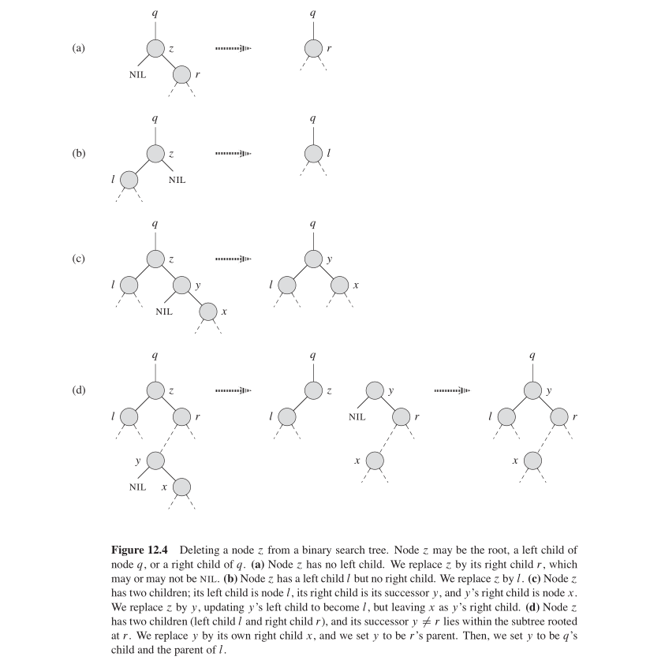

```
INORDER-TREE-WALK(x)
  if x != nil
      INORDER-TREE-WALK(x.left)
      print x.key
      INORDER-TREE-WALK(x.right)
```
## Recursion version
```
TREE-SEARCH(x,k)
  if (x == nil || k == x.key)
      return x
  if k < x.key
      TREE-SEARCH(x.left, k)
  else TREE-SEARCH(x.right, k)
```
## Iterative version
```
INTERATIVE-TREE-SEARCH(x,k)
  while x != nil and k != x.key
      if k < x.key
          x = x.left
      else x= x.right
  return x
```
## find min
```
TREE-MINIMUM(x)
  while x.left != nil
      x = x.left
  return x
```
## find max
```
TREE-MAXIMUM(x)
  while x.right != nil
      x = x.right
  return x
```
## find successor
### we can assuming that node on right subtree of BST may not have a successor
```
TREE-SUCCESSOR(x)
  if x.right != nil
      return TREE-MINIMUM(x.right) /* case1: min key in its right subtree */
  y = x.p
  while y != nil and x == y.right  /* case2: until x is y's left node */
      x = y
      y = y.p
  return y  /* find or nil */
```
## find predecessor
```
TREE-PREDECESSOR(x)
  if x.left != nil
      return TREE-MAXIMUN(x.left) /* case1: max key in its left subtree */
  y = x.p
  while y != nil and x == y.left  /* case2: until x is y's right child */
      x = p
      y = y.p
  return y /* find or nil */

```
## tree insert
```
TREE-INSERT(T, z)
  y = nil
  x = T.root
  while x != nil
      y = x
      if z.key < x.key
          x = x.left
      else x = x.right
  z.p = y                         /* link z's parent to y */

  if y == nil                     /* link z to specific postion */
      T.root = z
  elseif z.key < y.key
      y.left = z
  else y.right = z
```
```
REC-TREE-INSERT(T, ST, z)
  if T.root == NIL  // Base case1: T is empty
      T.root = z
      return
  if ST.left == NIL || ST.right == NIL  // Base case2
      y = ST.left or ST.right
      y = z

  if z.key < ST.left.key
      ST = ST.left
      REC-TREE-INSERT(T, ST, z)
  else
      ST = ST.right
      REC-TREE-INSERT(T, ST, z)
```
```
REC-TREE-INSERT-V2(T, z)
  if T.root == NIL
      T.root = z
  else REC-INSERT(NIL, T.root, z)
```
```
REC-INSERT(p, x, z)
  if x == NIL                       // insert x.p.left or x.p.right
      z.p = p
      if z.key < p.key
          p.left = z
      else
          p.right = z
  else
      if z.key < x.key
          REC-INSERT(x, x.left, z)  // recursive find on left subtree
      else
          REC-INSERT(x, x.right, z) // recursive find on right subtree
```
## Tree deletion


#### TRANSPLANT ---> replace u's position with v
```
TREE-TRANSPLANT(T, u, v)
  if u.p = NIL   // where u lies on the tree ---> three cases, top down direction
      T.root = v
  else if u == u.p.left
      u.p.left = v
  else u.p.right = v

  if v.p != NIL   // bottom up direction
      v.p = u.p
```

```
TREE-DELETION(T, z)
  if z.left == nil // case1
      TREE-TRANSPLANT(T, z, z.right)
  elseif z.right == nil //case2
      TREE-TRANSPLANT(T, z, z.left)
  else
      y = TREE-MINIMUM(z.right) // case3: z have both two kids
      if y.p != z  // y lies on left subtree
          TREE-TRANSPLANT(T, y, y.right)
          y.right = z.right // top down direction
          y.right.p = y // bottom up direction
      TREE-TRANSPLANT(T, z, y) // replace z with y
      y.left = z.left // arrow down
      y.left.p = y  // arrow up
```
