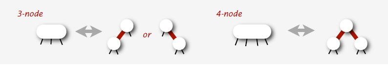
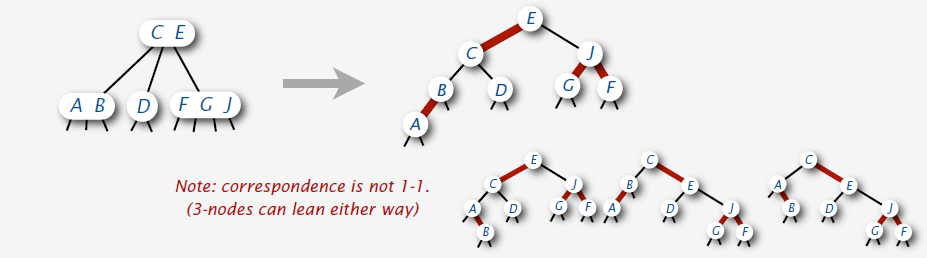
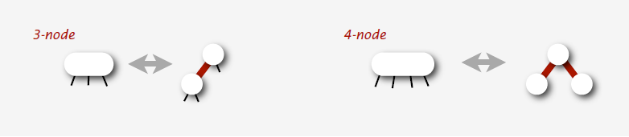
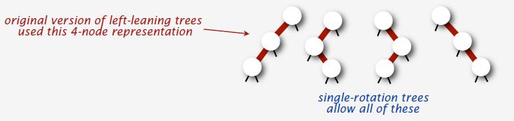
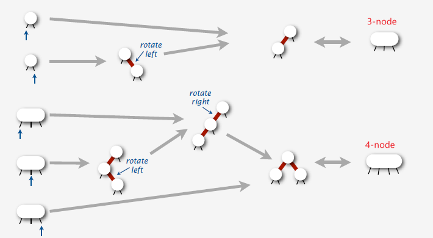
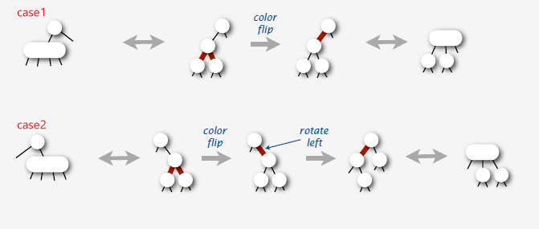
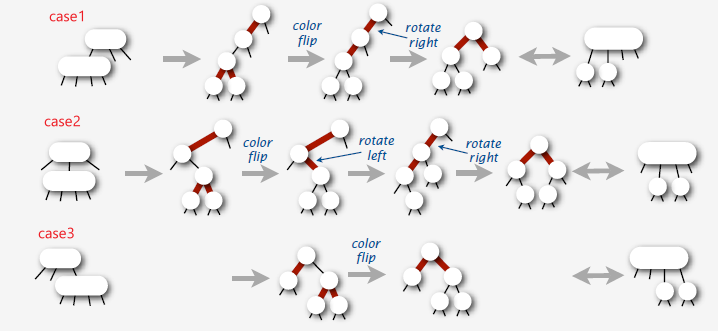

* 2-node: one key, two children
* 3-node: two key, three children
* 4-node: three key, four children

###### INSERT
  + search to bottom for key
  + 4-node at bottom: no room for new key
* Splitting 4-nodes in a 2-3-4 tree is an effective way to make room for instances
* Problems: **Doesn't work if parent is a 4-node** --- it means no room for the middle elemenet to flow up
* solutions:
* 1. Bottom-up solution:
  - use same method to split parent
  - continue up the tree while necessary
* 2. Top-down solution:
  - split 4-nodes on the way **down**
  - insert at bottom

##### Splitting 4-nodes on the way down --- follow Top-down solution
* Transformations to split 4-node

* Invariant: "current" node is not a 4-node
* **Consequences**:
  - 4-node below a 4-node case never happens
  - Bottom node reached is always a 2-node or 3-node
###### splitting a 4-node below a 2-node
* is a **local** Transformations that works anywhere in the tree

###### splitting a 4-node below a 3-node
* is a **local** Transformations that works anywhere in the tree

##### growth of a 2-3-4 tree
* happens upwards from the bottom

##### Direct implementation of 2-3-4 tree
* is complicated because of code complexity

###### pseudocode
````
private void insert(Key key, Val val)
  Node x = root
  while (x.getCorrectChild(key) != nil)
    x= x.getCorrectChild(key);
    if x.is4Node()
      x.split()

  if x.is2Node()
    x.make3Node(key, val)
  else if x.is3Node()
    x.make4Node(key, val)

  return x
````
* Maintaining multiple node types is **cumbersome**
  - `What's the representation?`
  - `Need multiple compares to move down in tree`
  - `Large number of cases for splitting`
  - `Need to covert 2-node to 3-node and 3-node to 4-node`

* Bottom line: could do it, but stay tuned for an easier way --- LLRB trees

##### RBT
* 1. Represent 2-3-4 tree as a BST
* 2. Use **internal** red edges for 3- and 4- node


* **key properties**:
  - elementary BST search works
  - easy to maintain a correspondence with 2-3-4 trees

* **NEW VARIANT**: Left-leaning RBT
##### Left-leaning RBT
* 1. Represent 2-3-4 tree as a BST
* 2. Use **internal** red edges for 3- and 4- node
* 3. **Require that 3-nodes be left-leaning**

* **key properties**:
  - elementary BST search works
  - easy to maintain 1-1 correspondence with 2-3-4 trees
  - trees therefore have perfect black-link balance

* Disallowed:
  - right-leaning 3-node representation
  - two reds in a row ???


* IMPORTANT NOTES:
  - Other BST methods also work
  - Order statistics
  - Iteration


##### Insert implementation for LLRB trees
* is best expressed in a recursive way
```
  private Node insert(Node h, Key key, Value val) {
    if (h == null)
      return new Node(key, val);

    int cmp = key.compareTo(h.key);

    if (cmp == 0) h.val = val;
    else if (cmp < 0)
      h.left = insert(h.left, key, val);
    else
      h.right = insert(h.right, key, val);
    return h;
  }
```
* Note: effectively travels down the tree and then up the tree.
  - simplifies correctness proof
  - simplifies code for balanced BST implementations
  - could remove recursion to get stack-based single-pass algorithm


##### Insert a new node at the bottom of a LLRB tree
* follows directly from **1-1** correspondence with 2-3-4 trees
  - 1. Add new node as usual, with ***red*** link to glue it to node above
  - 2. Rotate if necessary to get correct 3-node or 4-node representation

  

##### Splitting a 4-node
* is accomplished with a **color flip**

* key points:
  - preserves perfect black-link balance
  - passes a **RED** link up the tree
  - reduces problems to inserting(that link) into parent

##### Splitting a 4-node in a LLRB tree
* follows directly from 1-1 correspondence with 2-3-4 trees

  1. Flip colors, which passes red link up one level
  2. Rotate if necessary to get correct representation in parent (using precisely the same transformations as for insert at bottom)

###### Parent is a 2-node: two cases

###### Parent is a 3-node: three cases


###### Inserting and splitting nodes in LLRB trees
* are easier when rotates are done on the way up the tree
* problems:
  1. insert might leave right-leaning red
  2. two reds in a row
##### NEW TRICK: Do rotats on the way UP the tree
  1. left-rotate any right-leaning link on search path
  2. right-rotate top link if two reds in a row found
  3. trivial with recursion(do it after recursive calls)
  4. no corrections needed elsewhere

##### Insert code for LLRB tree
  1. insert a new node at bottom
  2. split a 4-node
  3. enforce left-leaning condition
  4. balance a 4-node

* if 1-3-4-2, it's insert implementation for 2-3 tree

##### Why revisit RBT?
* LLRB is far simpler than previous version
  - left-leaning restriction reduces number of cases
  - recursion gives two easy chances to fix each node
  - take your pick: top-down 2-3-4 or bottom-up 2-3

##### Deletion
* Delete strategy:
*  `invariant: current node is not a 2-node`
*  `introduce 4-node if necessary`
*  `remove key from bottom`
*  `eliminate 4-nodes on the way up`

##### delete the maximum
 1. search down the right spine of the tree
 2. if search ends in 3-node or 4-node: just remove it
 3. removing a 2-node would destroy balance
     - transform tree on the way down the search path
     - invariant: current node is not a 2-node
* in summary: by carring a `red-link` down the right spine of the tree
* tips: need to **combine or borrow** sibling if delete is a 2-node

##### delete the minimum
* Invariant: either h or h.left is RED
* Implication: deletion easy at bottom
* Borrow from sibling
  - if h.left and h.left.left are both BLACK
  - two cases, depending on color of h.right.left

##### delete an arbitrary node
* reduce to deleteMin()

##### Analysis
* **Theorem**: With red-black BSTs as the underlying data structure, we can implement an ordered symbol-table API that supports insert, delete, delete the minimum, delete the maximum, find the minimum, find the maximum, rank, select the kth largest, and range count in guaranteed logarithmic time.
