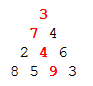

[DP]：https://brilliant.org/wiki/problem-solving-dynamic-programming/
### Example: maximum paths
```
You are supposed to start at the top of a number triangle and chose your passage all the way down by selecting between the numbers below you to the immediate left or right.

Your goal is to maximize the sum of the elements lying in your path.

For example, in the triangle below, the red path maximizes the sum.

```


* solution: bootom up fashion
```
best from this point=this point+max(best from the left, best from the right)
```
