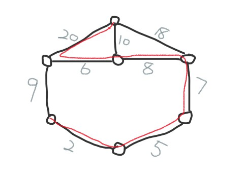
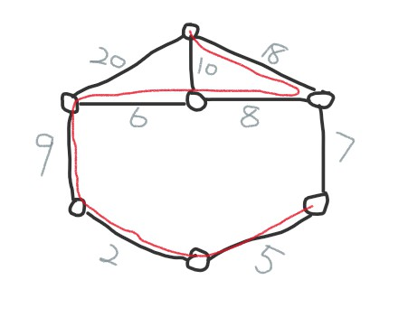

# problem1
1. this problem is aim to find the index pair (i, j) which meet below formular
2. max-interval = max_j - min_i where 1<=i<j<=n
3. max_j = max{Aj, Aj+1, ..., An} and max_i = min{A1, A2, ..., Ai}
4. and the question is to mind every max and min value in each two partition array.
5. then we have the recursive relation
(j,i) = max{Aj,...,An} - min{A1,...,Ai} where 1<=i<j<=n then we have our pseudocode
```
MAX-INTERVAL-PAIR(A)
  //let set S to keep the index pair (i, j) and
  //array B to keep current max interval
  //let lp_min[i] store the minimal vale from A1,...,Ai
1  lp_min[1] = A[1]
2  for i = 1 to n
3      lp_min[i] = min(lp_min[i], A[i])
4  //let rp_max[j] store the maximual vale from Aj,...,An
5  rp_max[n] = A[n]
6  for j = n downto 1
7      rp_max[j] = max(rp_max[j], A[n])
8  for k = 1 to n // k is where we partition the array
9       cur_max_interval = rp_max[n-k] - lp_min[k]
10      j = index of rp_max
11      i = index of lp_min
12      B <- current_max_interval
13      S <- (i,j)
14  max = B[1]
15  for k = 2 to n-1
16      if B[k] > max
17          max = B[k]
18          (i,j) = S[k]
19  return (i,j)
```   
#### running time:
* 1 line-line two for loop, takes O(n) time to record left min and right max with element index
* 2 line-line takes O(n) to calculate max interval for each subproblem
* 3 line-line take thelta(n) to find the max interval of all subproblem and index pair
* 4 thus it takes O(n) for this algorithm
#### correctness:
the subproblem is to find max interval in each partition, after we record all the subproblem, and we can find the optimal solution for the value pair.

# problem2
* we use a degree attribute for every vertice in order to trace the size of each qlique that may exist
```
// let set S keep track of a maximal clique and
// V represents the adjacency vertices of current clique
// X represents the vertices already in current clique
// start with arbitrary vertice in G.V, then output the first maximal clique
FIND-MAXIMAL-CLIQUE(V, S, X)
1  if V u X == empty
2      output S is a maximal clique
3      return
4  for each vertice v in V
5      V' = V n G.Adj[v]
6      S' = S u v
7      X' = X n G.Adj[v]
8      FIND-MAXIMAL-CLIQUE(V', S', X')
9      V = V \ v
10     X = X u v
```
```
MAXIMAL-CLIQUE(G)
1  S = empty
2  X = empty
3  V = G.V
4  FIND-MAXIMAL-CLIQUE(V, S, X)
5  return S
```
+ running time:
* 1. line - assignment of V takes O(|V|)
* 2. since return a single maximal clique is required, so the recursive function will at most traverse all the edges with an arbitrary vertice, in other words, the first maximal clique will have this vertice contained, thus takes O(|E|) for this arbitrary vertice
* 3. then the total running time will be **O(|V|+|E|)**

# problem3
#### defination:
* 1 subgraph: H: V(H) belongs or equals to V(G) and E(H) belongs or equals
to E(G)
* 2 **spanning subgraph**: H: V(H) = V(G) and E(H) belongs or equals to E(G)

#### proof:
* 1. Assuming there's exist two MST T1 and T2 for this case
* 2. Since T1 and T2 differs even contains the same nodes, so there exists at least one edge e1 belongs only to one of them, assuming e1 belongs to T1
* 3. As T2 is another MST, thus, {e1} U T2 will forms a cycle C
* 4. As an MST, T1 contains no cycle, therefore, cycle C must has another edge e2 which not in T1
* 5. Since e1 was chosen as the lowest weight belongs to T1, thus, the w(e2) > w(e1)
* 6. Replacing e2 with e1 in T2 will generates another spanning tree with smaller weight which contradicts assumption T2 is MST

#### examples of second-best MST




# problem4
#### all shortest path in this case should have the same lowest total weight to meet the definition
#### define C(u,v) as the cost
#### set Q used to keep total cost with each single path
```
NUM-SHORTEST-PATH(G, u, v)
  // u,v represents src and dst vertices respectively
1  for i = 1 to G.V
2      total_cost[i] = 0
3  Q = empty
4  SINGLE-PATH-COST(src, dst)
5  HEAP-SROT(Q) // increasing order
6  num = COUNT-LOWEST-COST(Q)
7  output num
```
```
SINGLE-PATH-COST(s, d)
  // recursively compute the total cost of each single path
1  if d == v // reach dst vertice
2      Q <- total_cost[i]
3      i = i + 1
4      return
5  else
6      for each vertice v in G.Adj[s]
7          s = v
8          total_cost[i] = total_cost[i] + C(s,v)
9          SINGLE-PATH-COST(s, d)
```
```
COUNT-LOWEST-COST(Q)
1  lowest = Q[1]
2  num = 1
3  for i = 1 to G.E
4      if Q[i] != lowest
5          return num
6      else
7          num = num + 1
```
+ running time:
1. SINGLE-PATH-COST takes O(|V|*|E|) to compute every single path from u to v
2. initialize of total cost for each vertice takes O(V)
3. Generally, heap sort takes O(VlogV)
4. COUNT-LOWEST-COST takes thelta(E) to find the number of shortest paths

+ correctness:
1. SINGLE-PATH-COST recursively compute the total costs of each single path
2. heap sort guarantee the Q[1] indicates the cost of the shortest path
3. COUNT-LOWEST-COST uses to count how many shortest paths with the same lowest cost
