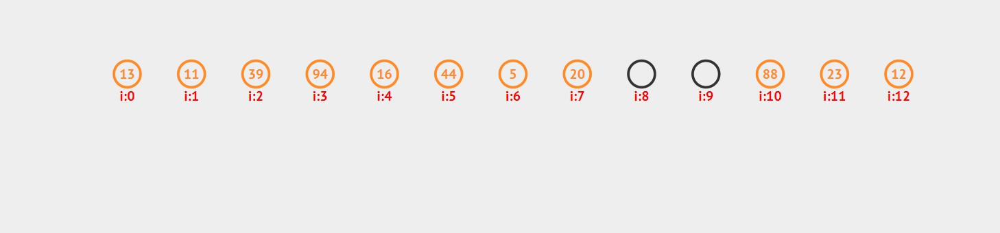

### problem 1
+ desc: x = a + b where a,b belongs two array A, B sizeof n (not sorted)
+ requirement: O(nlogn)
```
ELEMENT-EXIST(A, B, x)
  HEAPSORT(B)
  for i = 1 to n
      y = x - A[i]
      exist = BIN-SEARCH(B, 1, n, y)
      if exist
          return true
  return false
```
```
BIN-SEARCH(B, begin, end, y)
  mid = (begin + end)/2
  if B[mid] == y
    return mid
  if begin >= end
    return -1
  if B[mid] < y
    return BIN-SEARCH(B, mid + 1, end, y)
  if B[mid] > y
    return BIN-SEARCH(B, begin, mid - 1, y)
```
+ running time:
*1 heapsort for array B cost O(nlogn)
*2 it takes n times at most to walk array A, and BIN-SEARCH takes O(logn) at most, so line7~line12 will takes at most O(nlogn) time to find whether there exist such a value pair
*3 thus, running time is O(nlogn)

### problem 2
+ recurrence

### problem 3
+ show running time thelta(n^2) if array has decreasing order
+ example A = [20 19 17 15 13 10 9 7 6 4 3 1]
+ we can see array is sorted in decreasing order, on first partition, we choose 1 as pivot, then we generate two subarray with 0 element and n-1 elements, subarray with 0 element will immediately return, thus cost
thelta(1), and partition on subarray [19 17 15 13 10 9 7 6 4 3 1 20] will also generate two subarray of size 0 and n - 2 representatively. we know partition operation cost thelta(n) each time, so the recurrence will apply as T(n) = T(n-1)+thelta(1)+thelta(n) if unbalanced partition happens every time, with the substitution method, we know the running time is T(n) = thelta(n^2)

### problem 4
```
K-CLOEST-ELEMENTS(S, k)
  median = (1+n)/2 //n is odd
  // build hash table for set S of size n, which takes thelta(n)
  j = SELECT(S, 1, n, i)
  value = HASH-SEARCH(T, j)
  if value == S[median]
      // then we know S[median] is the ith smallest element in the set
      left = SELECT(S, 1, n, i-1)
      right = SELECT(S, 1, n, i+1)
  // save the smaller element the (i-1) and (i+1) smallest in array B
  interval_l = |S[left] - S[median]|
  interval_r = |S[right] - S[median]|
  if interval_l > interval_r
      B[indies++] = S[right]
      right = SELECT(S, 1, n, i+1)
  else interval_l < interval_r
      B[indies++] = S[left]
      left = SELECT(S, 1, n, i+1)
```
```
K-CLOEST-ELEMENTS(S, k)
  mid = (1+n)/2
  median = S[mid]
  /* use median to partition S */
  exchange S[mid] with S[n]
  q = PARTITION(S, 1, n)
  /* subarray S[1...q-1], S[q+1...n] contains elements less or bigger than A[q] respectively */
  i = q - 1
  j = 1
  left = SELECT(S, 1, q-1, i)
  right = SELECT(S, q+1, n, j)
  for num = 1 to k -1
      interval_l = abs(S[left] - median)
      interval_r = abs(S[right] - median)
      if interval_l > interval_r
          B[indies++] = S[right]
          i = i -1
          right = SELECT(S, q+1, n, i)
      else
          B[indies++] = S[left]
          j = j + 1
          left = SELECT(S, 1, q-1, j)
  B[indies] = median
  output B
```
+ correctness:
*1 we use median to partition the set S, after the partition, left subarray contains elements less
than S[q], right subarray contains bigger.
*2 to find the k - 1 numbers elements closest to median, every time we compare the biggest element
on left with the smallest one on right, and choose the small one to save in array B
*3 finally, we save median to B, which contains k numbers  
+ running time
*1 partition takes thelta(n)
*2 SELECT takes linear time
*3 line~line takes constant k-1 times to pick the expected element, thus takes (k-1)O(n)
*4 cause k is much less than n, thelta(n)+(2+k-1)O(n) = O(n), thus running time is O(n)

### problem 5
+ 1 separate chain
+ 2 linear probe

+ 3 quad probe --- base/step
+ 4 double hashing
