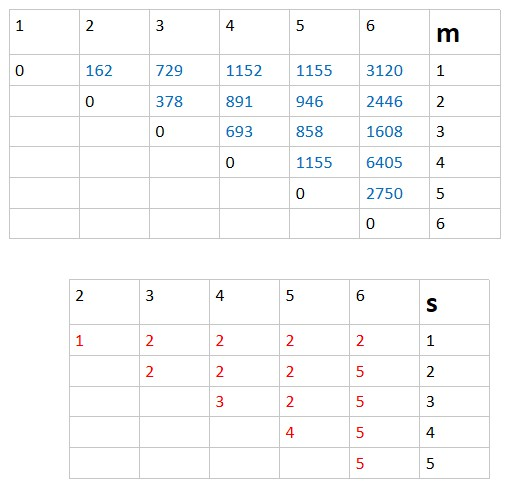
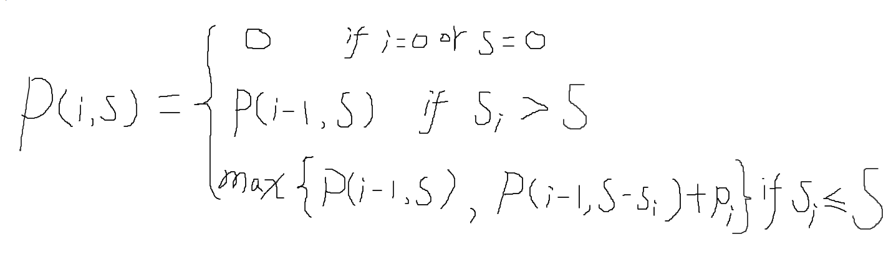

### problem1
```
MAX-PAYOFF(A, B)
1  sort A and B in decreasing order with MERGE-SORT
2  max-payoff = 1
3  for i = 1 to n
4      max-payoff = max-payoff * A[i]^B[i]
5  return max-payoff
```
#### correctness
+ Assuming set A {a1, a2, ..., an} and set B {b1, b2, ..., bn} are sorted
in decreasing order, then value pair ai and bi is what we expect to get the
max payoff.
+ proof: here we use induction to proof the correctness.
+ 1 if A and B only have {a1, a2}, {b1, b2}, then a1^b1 * a2^b2 is greater than
a1^b2 * a2^b1 if we divide them, we'll got (a1/a2)^(b2-b1), which is less than 1
because a1 > a2, b1 > b2
+ 2 for {ai, aj} and {bi, bj}, which 1<= i < j <=n,  Assuming
ai^bj * aj^bi is one of the optimal solution, so ai^bj * aj^bi should not less than ai^bi * aj^bj, which means (ai/bi)^(bj-bi) >= 1, but we know ai > aj, bi >bj, so at least ai^bi * aj^bj should at least be one of the optimal solution but not ai^bj * aj^bi.
+ 3 if we detach ai and bi from current set, then for each element left in sets A and B, it should recursively follow the same forms to get the optimal solution
#### running time:
+ 1 for random sets A and B, merge sort takes O(nlogn)
+ 2 it takes liner time to calculate the maximum payoff, thus O(n)
+ 3 then the running time should be O(nlogn)

### problem2
+ 1 follow the recurrence and basic principle, we got two tables, one indicate how many times it takes to multiple each sub matrix chain, another indicate for each sub matrix chain, where we split the chain

 

+ 2 the S table shows us where to split the sub chain. so we got
 **((A1A2)((A3A4)A5)A6)** multiple order to get the minimal multiple times
which shows as m[1,6] = 3120

### problem3
#### we define P(i, s) the maximum profit of this KNAPSACK problems where i, s represent first i items and current size of the knapsack respectively. so our target is to find a optimal solution for P(n, B)
1. P(i, s) represent the subproblem of the target p(n, B)
2. generally, if P(n, B) represent maximum profits, then we shall consider whether
including items n or not. here we have two case2:
 + when we have items n, then P(n-1, B-sn) + pn represent the final target, which transform to the subproblem
 + when not included, subproblem occurs as P(n-1, B)
3. so the recurrence should represent as

4. we need a n+1 and B+1 sizes tables P[n+1][B+1] to record all the combinations.
#### follow the recurrence above, we have our pseudocode below
```
MAX-PROFIT-KNAPSACK(n, B)
1  for i = 0 to n
2      P[i][0] = 0
3  for i = 0 to B
4      P[0][i] = 0
5  // fill the table
6  for i = 1 to n
7      for j = 1 to B
8          if s[i] > j
9              P[i][j] = P[i-1][j]
10         else     
11             P[i][j] = max{P[i-1][j], P[i-1][j-s[i]] + p[i]}
```
### in order to construct the solution, we need to go through the table P, and choose the specific items to set Q
```
FIND-ITEMS(i, j)
1  if i == 0 // base
2     return
3  if P[i][j] == P[i-1][j] // not pick
4     FIND-ITEMS(i-1, j) // back to subproblem
5  else if s[i] <= j and P[i][j] = P[i-1][j-s[i]] +p[i] // items i should go to set Q
6     put i to set Q(represent as array)
7     FIND-ITMES(i-1, j-s[i]) // back to subproblem
```

#### correctness:
1. MAX-PROFIT-KNAPSACK is used to fill the table, and it follows the recurrence relationship
2. FIND-ITEMS is used to find the index of items that should go to set Q

#### running time:
1. for MAX-PROFIT-KNAPSACK, it takes O(n*B) to fill table P
2. for FIND-ITEMS, it takes O(logn) to recursively find item index
3. the total time should be O(n\*B) + O(logn), so the running time is O(n*B)

### problem4
+ Let s(i,j) = M - j + i + sum (li, li+1, ..., lj), it represent how many extra space will required for each line contains words i through j.
+ define the cost of including a line contains word i through j to the sum we what to minimize as: c_extra(i, j) = s(i,j)^3 if s(i,j) > 0 and j < n; = 0 if s(i,j) > 0 and j = n(should fit in last line, then makes no contributions to minimal sum)
+ we want to minimize sum of c_extra over all lines, so the subproblems are how should we arrange words 1,...,j(where j = 1,...,n)
+ considering an optimal subproblem which words 1,...,j, if we know where to split it, suppose i, where 1 <= i <= j, then words i through j will fit into last line in this optimal arrangement. further, words 1 through i - 1, will be it's subproblem. we define c[j] the cost of an optimal arrangement of words 1 through j, then c[j] = c[i-1] + c_extra(i,j)
+ our target is to minimize c[j], so the problem lies on where we split this optimal arrangement, so we have to go through all possible split to find out which split results the minimal. so c[j] = min(c[i-1] + c_extra(i,j)) where 1 <= i <= j
+ in order to track where we split an optimal arrangement, we need to store the position at where we split, if split at i, then p[j]=i.
+ with above recurrence relationship, we have our pseudocode
```
FILL-PRINT-NEATLY(l, n, M)
1  //s, c_extra, p are all array
2  // fill table s[1,..n, 1,...,n]
3  for i = 1 to n
4      s[i,i] = M - li
5      for j = i+1 to n
6          s[i,j] = s[i, j-1] - lj - 1
7  // fill table c_extra
8  for i = 1 to n
9      for j = i to n
10          if s[i,j] >=0 and j = n // the last line
11              c_extra[i,j] = 0
12          else if s[i,j] < 0 // can't fit in lines
13              c_extra[i,j] = unlimited
14          else c_extra[i,j] = s[i,j]^3
15  // compute c[j]
16  for j = 1 to n
17      c[j] = unlimited
18      for i = 1 to n
19          if c[i-1] + c_extra[i,j] < c[j]
20              c[j] = c[i-1] + c_extra[i,j]
21              p[j] = i
22  return c and p
```
+ to print neatly
```
HOW-TO-PRINT(p, j)
  i = p[j]
  if i == 1
      k = 1
  else
      k = HOW-TO-PRINT(p, i-1)
  output k, i, j
```
