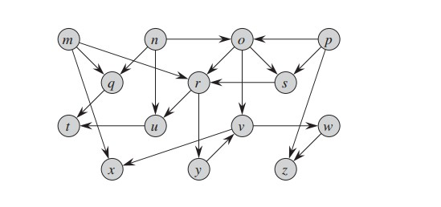
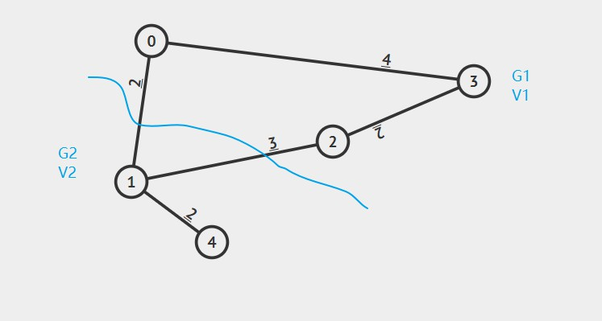

### problem1
```
ADJ-MATRIX-GSQUARE(G)
   let m' be the adjacency-matrix for G
1  initilize |V|*|V| matrix m to m'  
2  for each vertice u in G.V
3      for each v of Adj[u]
4          for each vertice w of Adj[v]
5              if m'[v, w] == 1
6                  m[u, w] = 1
7  return m
```
#### running time:
+ 1 initilize matrix takes O(V^2)
+ 2 considering selfloop may exist, line2-4, each loop takes at most |V| times, thus taking O(V^3)
+ 3 so the total running time will be O(V^3)

### problem2
+ use DFS to compute finish time v.f for each vertice v

 
+ based on the Parenthesis theorem, we have
  1. (m(q(tt)q)(r(uu)(y(v(w(zz)w)(xx)v)y)r)m)
  2. (n(o(ss)o)n)
  3. (pp)
+ so the finish time is apprently shows by this parenthesis, decreasing order each vertice with its finish time
* p->n->o->s->m->r->y->v->x->w->z->u->q->t

### problem3
```
TOPOLOGICAL-SORT-INDEGREE(G)
   let Q be the queue to store current vertices with in-degree 0
   // compute indegree of every vertice
1  for u = 1 to G.V
2      indegree[u] = 0
3  for each veritce u in G.V
4      for each v in Adj[u]
5          indegree[u]++
6  // enqueue current vertice with in-degree 0
7  for u in G.V
8      if indegree[u] = 0
9          ENQUEUE(Q, u)
10 while Q != empty
11     u = DEQUEUE(Q)
12     array[i++] = u // array record Topological sort order
13     visited_num++
14     for each v in Adj[u]
15         indegree[v]--
16         if indegree[v] != 0
17             ENQUEUE(Q, v)
18 if visited_num != G.V // cyclic, not a DAG
19     error "Topological sort not exist"
20 print array    
```
#### running time:
1. line7-9, takes thelta(V) for all vertices(enqueue operation takes O(1))
2. line10-17, for all vertices, queue operation takes O(V), for each vertice v  with Adj[u], it takes thelta(E) to scan all its vertices, thus, for traverse all vertices in teh graph, it takes O(E)
3. so the total running time will be thelta(V) + O(V) + O(E), which equals **O(V+E)**

#### correctness:
* the main idea is to record a sequence with in-degree 0, we can use a queue to record this sequence which represent a Topological sort; every time we dequeue a vertice u with in-degree 0, we decrease the in-degree of all its neighbors, then if any in-degree of its neighbor decrease to 0, we enqueue this vertice, so every vertice with in-degree 0 in the end will be enqueued and dequeued, and we keep track this process with an array. finally, we print out the array, the sequence will represent a topological sort.
* at given time, the in-degree 0 of neighbors of a dequeued vertice is likely more than 1, so we follow a dictionary order to enqueue the these in-degree 0 vertices.
* considering there may exist cycle in the graph, so we use a variable visited_num to record how many vertices have been processed, if there's node been processed more than one time, there exist no topological sort in this case.

### problem4
+ this algorithm will fail to find MST, let use and example to show our claim.

+ in this example, we have a weighted graph, if we use the blue line to partition this graph, as the algorithm shows, edge(0,1) with weight 2 will lies on the path of MST which the path include edge (1,4)(1,0)(0,3)(3,2) with total weight of 2+2+4+2 equals to 10.
+ however, according to kruskal's algorithm, the MST should include edge (4,1)(1,2)(1,3)(2,3) with total weight of 2+2+3+2 equals to 9.
