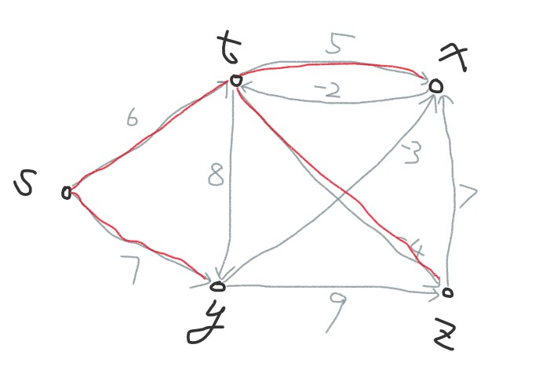
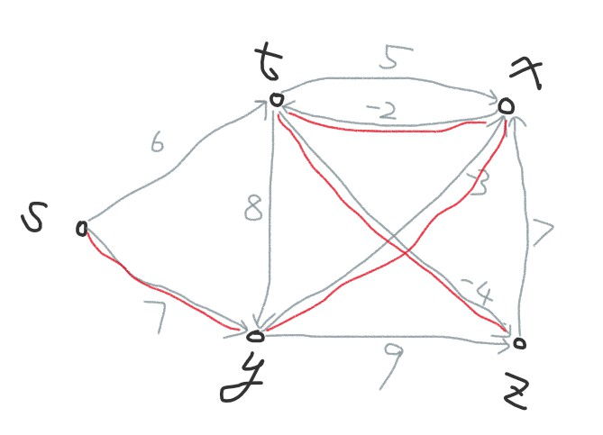

### problem1
+ let M represent matrix where M[i,j] represent the weight from vertices i to j, if M[i,j] equals 0, then there's no edge from i to j
```
MST-PRIM-MATRIX(G, M, r)
1  for each v vertices in G.V
2      v.value = infinity
3      v.parent = NIL
4  r.value = 0
5  Q = G.V
6  while Q != empty
7      u = EXTRACT-MIN(Q)
8      for each v in G.V
9          if v in Q and M[u,v] != 0 and v.value > M[u,v]
10              v.value = M[u,v]
11              v.parent = u
```
#### running time:
+ 1 for outer loop, it takes O(V) to extract all the vertices
+ 2 for inner loop, it takes O(V) to exams all the vertices in this row of M.
+ 3 line10 will implicate issue an DECREASE-KEY operation, thus takes O(logV)
+ 4 the running time thus will take O(V*(V+logV)), which is equivalent to O(V^2)

### problem2
+ 1 follow Dijkstra's algorithm, if we start from s, then MST will indicates with the red line in below photo which has total weight 6+(-4)+(5)+7=**14**.

 
+ 2 however, the real MST from s is below, which has 7+(-3)+(-2)+(-4)=**-2** as its total weight

 

### problem3
+ let array cap represent the max capacity from source s to each vertices, arc(u,v) function represent the weight from vertices u to v
+ in the definition of complete digraph, there's no isolate vertices, cause they are directly connected.
```
MAX-CAPACITY-ALLPATHS(G, s)
1  for i = 1 to G.V
2      cap[i] = -infinity
3      prev[i] = -1
4  cap[s] = infinity
5  Q = G.V
6  while Q != empty
7      u = EXTRACT-MAX(Q)
8      for each vertices v in G.Adj[u]
9          node_cap = min(cap[u], arc(u,v))
10         if node_cap > cap[v]
11             cap[v] = node_cap
12             prev[i] = u
13             INCREASE-KEY(Q, v.capacity, node_cap)
14 return cap   
```

#### running time:
1. line1~4 takes O(V) for initialize
2. we use max heap to records capacity of each vertices
3. just as what discussed with Dijkstra's algorithm, the running time remains O(E*logV), cause all vertices are reachable from source s.

#### correctness:
1. we implement the max-priority queue with binary max heap, and the capacity of all vertices except source s are all initialize to -infinity, which means, other nodes don't have capacity before the invariant loop
2. in line9, we have to guarantee the capacity of all other nodes can't beyond previous node or arc between the edge
3. so the outer loop starts with the node that has maximal capacity and update it's adjacency node with the maximal capacity of previous node.
4. line13 issues an INCREASE-KEY operation which will update current Q so that we always process the node with max capacity
5. after loop terminates, cap[1,2,...|V|] will represents the maximal capacity of on the path from s to v

### problem4
+
```
DIJKSTRA-V2(G, w, K, s)
1  for v = 1 to G.V
2      weight[v] = inf
3      prev[v] = NIL
   initialize array B of size K*V, B[i] keep vertices which has weight i
4  B[0] = s
5  weight[s] = 0
6  while index != V*K
7       index = index + 1
8       if CHECK(B[index] == empty)
9           continue
10      // extract vertices from bucket
11      u = B[index]
12      for each vertices v in G.Adj[u]
13          tmp = weight[v]
14          if weight[v] > weight[u] + w(u,v)
15              weight[v] = weight[u] + w(u,v)
16              prev[v] = u
17              B[weight[v]] = v
18              if tmp != inf // weight[v] must in B[weight[v]]
19                  del v in B[weight[v]]
```
#### correctness:
1. we use double linked list to implement array B, which allows O(1) time for CHECK/ADD/DEL operations
2. because K is quite smaller number, so it at most have K*(V-1) shortest paths, after line6(outer loop) terminates, there's no vertex in the bucket
3. line11~19, extract vertices and traverse its edges, which has the same logic as EXTRACT-MIN
4. line17 has the same result with DECREASE-KEY function as it push back the vertices to the bucket

#### running time:
1. line6, outer loop, takes O(K*V) to go over all the bucket
2. line12~19, takes at O(E) to go over all the edges, cause ADD/DEL takes O(1) on bucket
3. thus, the running time will be O(E+K*V)
