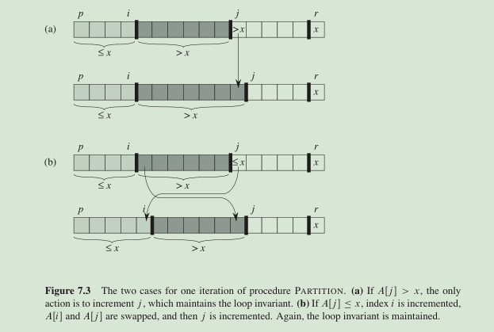

### three-step DAC process for sorting a typical subarray A[p...r]
+ Divide : partition: A[p...q-1] A[q+1...r] ---> compute index q.
+ Conquer: sort the two subarray by recursive calls to **quicksort**.
+ Combine: no work to combine, cause subarrray is already sorted.

```
QUICKSORT(A, p, r)
  q = PARTITION(A, p, r)
  QUICKSORT(A, p, q-1)
  QUICKSORT(A, q+1, r)
```

```
PARTITION(A, p, r)
  x = A[r] // x is the pivot element each round
  i = p - 1
  for j = p to r - 1
      if A[j] <= x
          i = i + 1
          /* A[i] is bigger than x, except first round where A[1] exchange with itself */
          exchange A[i] with A[j]
  /* exchange the first bigger element with pivot */
  exchage A[i+1] with A[r]
  return i + 1
```
+ running time highly depends on whether partitioning is **balanced**

+ | partition  | mergeSort | insertSort |
  | ---------- | --------- | ---------- |
  | balanced   | *         |            |
  | unbalanced |           | *          |
+ worst case partitioning
+ recurrence : T(n) = T(n-1) + T(0) + thelta(n)

+ | part                                | cost      |
  | ----------------------------------- | --------- |
  | recursive call on array of size 0   | thelta(1) |
  | recrusive call on array of size n-1 | thelta(n) |
+ note: if we have a array which already in decreasing order, the **pivot** is always the smallest
  thus, we got this unbalanced partitioning
+ best case partitioning
+ recurrence : T(n) = 2T(n/2) + thelta(n)
+ running time: O(nlogn)

### random choose pivot element
+ expect the split of input array to be reasonably well balanced on average

```
RANDOMIZED-PARTITION(A, p, r)
  i = RANDOM(A)
  exchange A[r] with A[i] // so A[i] will be the expected pivot
  return PARTITION(A, p, r)
```
```
RANDOMIZED-QUICKSORT(A, p, r)
  q = RANDOMIZED-PARTITION(A, p, r)
  RANDOMIZED-QUICKSORT(A, p, q-1)
  RANDOMIZED-QUICKSORT(A, q+1, r)
```
