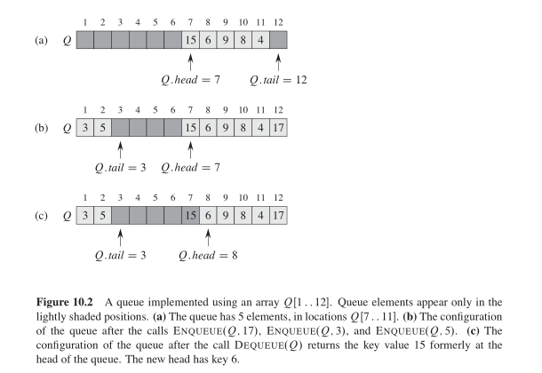

## operations on stack

```
STACK-EMPTY(S)
  if S.top == 0
    return true
  else
    return false
```
```
PUSH(S, x)
  S.top = S.top + 1
  S[S.top] = x
```
```
POP(S)
  if STACK-EMPTY(S)
      error "underflow"
  else
     S.top = S.top - 1
     return S[S.top + 1]
```
```
FIND-MIN(S)
  min = S[S.top]
  /* walk the whole stack will cause linear time */
  for i = S.top - 1 to 1
      if S[i] < min
          min = S[i]
  return min
```
+ running time:  Assming S has N elements. it will take O(N)

## operations on queue
+ question: why do not implement n elements in array A[1...n]???
+ 
```
ENQUEUE(Q, x)
  Q[Q.tail] = x
  if Q.tail = Q.length
      Q.tail = 1
  else
      Q.tail = Q.tail + 1
```
```
DEQUEUE(Q)
  x = Q[Q.head]
  if Q.head = Q.length
      Q.head = 1
  else
      Q.head = Q.head + 1
  return x
```
